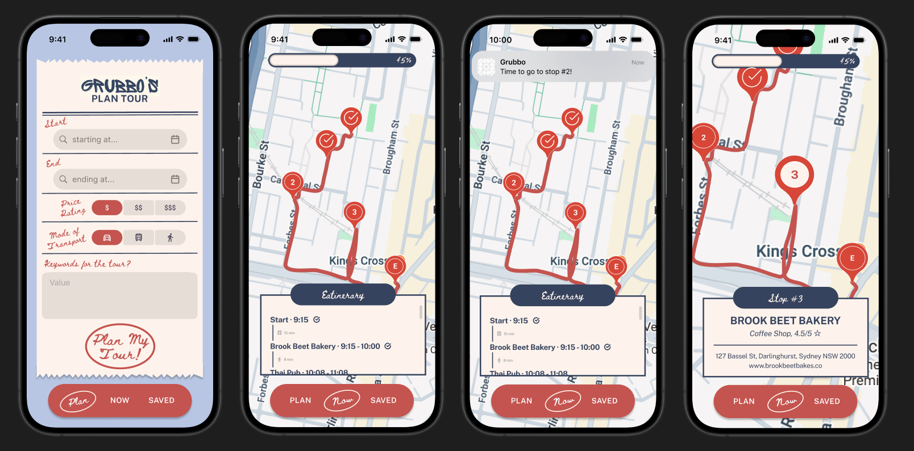

# 📱 GRUBBO — Smart Food Tour Planner

> A production-style mobile application for generating optimized food tours using real-time geolocation, map routing, and backend service orchestration.

**GRUBBO** is a React Native app that allows users to discover and navigate curated food routes in real time. It takes user preferences, finds nearby venues, computes efficient routes, and delivers live navigation with mobile-first UX and push notifications.

This project is an evolution of the original GRUBBO web platform into a **fully mobile, production-oriented system**.

---

## 🔗 Recorded Demos

- 🌐 **Web Version (original):**  
  > [Drive Link](https://drive.google.com/file/d/1wIERZsRaF30xJqzD6aerQHILIOAD9WIy/view?usp=sharing_)

- 📱 **Mobile Demo:**  
  > Coming soon! Just finalising the UI !

---

## ✨ Deliverables Timeline

- Mobile app scaffold (Expo + TypeScript) ✔️
- Multi-screen navigation (Plan, Current Tour, Saved) ✔️
- Places discovery via backend API ✔️
- Route computation + ordering ✔️
- Interactive map with markers & polylines ✔️
- Mobile UI polish - ⏳ In progress 
- Saved tours persistence - ⏳ In progress 
- Push notifications for upcoming stops - ⏳ In progress 
- API caching layer for cost control - ⏳ In progress 
- Live geolocation permissions + tracking - ⏳ In progress 

---

## 🧩 System Architecture

> Mobile App (React Native + Expo) -> REST API (Flask) -> [Places API, Routing Logic, Data Caching]

- The **mobile client** is responsible only for presentation and user interaction.
- All **business logic and data orchestration** live in the backend.
- External API calls are centralized and abstracted behind service layers.
- This separation allows independent deployment and reuse across platforms.

---

## 🧠 Technical Challenges & Solutions

### 1. Route Computation Under Real API Constraints

**Challenge:**  
Optimizing routes while respecting **rate limits, latency, and quota costs** from the external mapping APIs.

**Solution:**  
- Implemented a **greedy nearest-neighbor heuristic** to keep routing computationally cheap.
- Reduced distance matrix requests by:
  - pre-filtering candidates using bounding boxes
  - eliminating clearly suboptimal nodes early
- Structured routing as a backend service to isolate compute complexity from the client.

### 2. External API Cost & Quota Management

**Challenge:**  
Mapping and places APIs are expensive, and repeated mobile requests can easily exceed free-tier quotas during development and demos.

**Solution:**  
- Introduced a **server-side caching layer** for:
  - geocoding results
  - nearby places queries
  - route distance calculations
- Added **request deduplication** and fallback-to-cache on quota or network errors.
- Centralized all external calls behind a single backend gateway for cost visibility and control.

### 3. Web → Mobile System Migration

**Challenge:**  
The original GRUBBO platform was a Vue-based single-page application, primarily designed for planning tours in advance.

**Solution:**  
- Extracted all business logic into **backend services**.
- Rebuilt the **mobile UI into multi-tab applications** using native components.
- Implementing push notifications and live navigation.

---

## 📈 Why I Built This

GRUBBO started as an exploration of **full-stack engineering and optimised routing**. As it evolved, it became a deliberate exercise in:

- mobile-first system design
- API orchestration under cost constraints
- real-time geolocation workflows
- rebuilding a web platform into a native mobile experience

The goal was to move beyond prototypes and toward **production-style engineering tradeoffs**. But also - GRUBBO is something I'd use myself, truly!

---

## 🔮 Considering / Future Work

- Natural-language itinerary requests
- Load and performance benchmarking
